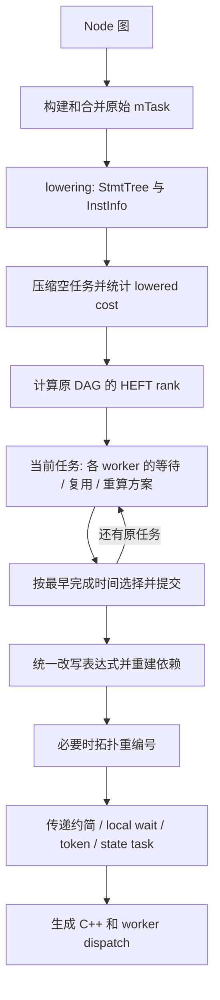

# Lowering 后的复制感知 HEFT：完整实现说明

本文以 2026-10-05 工作区源码为准，描述 `--mt-mode=on --mt-scheduler=rheft`
的实际行为。它先生成原任务的 lowered 指令流，再在 HEFT 选择 worker 时联合评估
等待、复用和重复计算。所有时间、rank 和 cost 均为相对工作单位，不是 ns、CPU 周期
或实测时间。文档中的算法是已经落地的实现，不包含尚未实现的搜索方案。

## 阅读导航

- [1. 模式和整体流程](#1-模式和整体流程)
- [2. 数据结构和依赖分类](#2-数据结构和依赖分类)
- [3. 统一成本模型](#3-统一成本模型)
- [4. HEFT 如何选择下一个任务](#4-heft-如何选择下一个任务)
- [5. Native 等待方案](#5-native-等待方案)
- [6. Reuse 本地副本方案](#6-reuse-本地副本方案)
- [7. Recompute 联合复制锥搜索](#7-recompute-联合复制锥搜索)
- [8. 复制块与消费者的时间计算](#8-复制块与消费者的时间计算)
- [9. 候选比较和完整伪代码](#9-候选比较和完整伪代码)
- [10. 数值示例](#10-数值示例)
- [11. 提交副本和生成代码](#11-提交副本和生成代码)
- [12. 重编号与运行时同步](#12-重编号与运行时同步)
- [13. 日志与报告字段](#13-日志与报告字段)
- [14. 参数与香山使用命令](#14-参数与香山使用命令)
- [15. 验证与性能评估](#15-验证与性能评估)
- [16. 当前限制与生成开销](#16-当前限制与生成开销)
- [17. 源码索引](#17-源码索引)

## 1. 模式和整体流程

### 1.1 选项实际决定什么

| 条件 | 执行的算法 |
| --- | --- |
| MT 开启，scheduler=heft | lowering 后执行普通 HEFT，不复制 |
| MT 开启，scheduler=list | 执行普通 list，不复制 |
| MT 开启，scheduler=rheft，worker 数大于 1 | lowering 后执行复制感知 HEFT |
| scheduler=rheft，只有 1 个 worker | 不创建复制规划器，执行普通 HEFT |

`rheft` 是独立的调度器名称，不再使用 `--mt-replication` 选择复制模式。
旧的单线程 `replicationOpt()` 不由 MT 调度流程调用。
单线程 active 流程的原有调用保留，与 rheft 及其预算参数无关。
Config 中的 `MtReplication`、`MtScheduleReplication` 两个 bool 已删除，
仅 `MtScheduler == "rheft"` 决定是否启用当前复制算法；默认 heft 不复制。

旧命令 `--mt-scheduler=heft --mt-replication=schedule` 改为 `--mt-scheduler=rheft`；
普通基线使用 `--mt-scheduler=heft` 或 `list`。旧 `--mt-replication=off|on|schedule`
选项不再接受。保留的 `--mt-replication-max-ops`、`--mt-replication-min-fanout`
只控制 rheft，不会在 heft/list 下自动开启复制。
worker 数在生成时由 `GSIM_THREADS` 决定，生成器默认值为 1；运行时不能仅修改
该变量就改变已经生成的 worker 数。

### 1.2 生成期调用关系



对应源码调用：

```text
CppEmitterMt::prepare()
  MtTaskPartitioner::build()
  MtTaskLowerer::generateStmtTrees()
  MtWorkerBuilder::build()
    compactEmptyTasks()
    task.cost = mtLoweredTaskCost(task)
    buildEdgeCommunicationNodes()
    创建 MtHeftReplication
    scheduleHeft(..., replication)
      每个 task/worker: replication.evaluate(native, ...)
      每个选中方案: replication.commit(...)
      全部原任务处理完: replication.finish()
    reorderHeftTasks()
    输出规划和最终调度报告
    transitivelyReduceTaskEdges()
    collectWorkerLocalNodes()
    buildStateUpdates()
    构建 local wait / token / dispatch
```

复制决策已移入 `scheduleHeft()`，仅在 `MtScheduler=rheft` 时启用。没有 lowering 前的 owner 预分配，没有选定副本后
的第二次 HEFT 重调度，也不再用旧 joint 的追加链覆盖 HEFT 时间线。

### 1.3 lowering 前后分别负责什么

最初划分仍使用结构成本决定 mTask 粒度，保留已有合并规则。符合周期初更新条件的
寄存器源先从计算任务成员中拿出，状态任务在 worker 调度后构建。

lowering 完成计算任务的成员排序、条件路径合并、局部变量识别、memory/sparse
register 辅助语句生成，产生 `StmtTree` 和 `InstInfo`。没有有效代码的任务随后压缩，
相关前驱/后继重新连接。本文的“原任务”指此时剩下的计算任务，不是初始 Node、
SuperNode 或空任务压缩前的编号。

普通 HEFT 和复制感知 HEFT 都覆盖写 `task.cost`，使用指令流成本。
原始结构成本仍影响分组边界，但不直接决定 worker 的占用时长。

## 2. 数据结构和依赖分类

### 2.1 HEFT 的调度状态

| 状态 | 含义 |
| --- | --- |
| `order` | 原任务按 rank 降序排列的列表，调度期间不重排 |
| `result.owner[T]` | 已选 worker，未规划时为 -1 |
| `completion[T]` | T 在当前静态时间线中的完成时间 |
| `timelines[w]` | 按 start 排序的区间映射，每项有 task、start、finish |
| `result.start/finish` | 原任务及新增复制任务的规划区间 |
| `result.chains[w]` | 调度结束后按时间线顺序取出的任务列表 |
| `result.makespan` | 已规划任务的最大 finish |

新复制块结束时间不晚于消费者开始时间，所以消费者的 finish 也覆盖对应复制块
对 makespan 的贡献。

新算法不在 `MtTask` 上预先写入 owner 约束；每个原任务会评估所有 worker。
没有每 worker 的任务数上限；`--mt-target-tasks` 是划分粒度参数，不是 worker 容量。

### 2.2 复制规划器的状态

| `MtHeftReplication::Impl` 成员 | 含义 |
| --- | --- |
| `originalCount` | 开始 HEFT 时的原计算任务数 |
| `data[T][P]` | T 从原生产任务 P 读取的不同 Node 指针集合 |
| `ordering[T]` | T 必须保留的非纯数据前驱任务 |
| `replicas[w]` | 原始 Node → w 上已创建的副本 Node |
| `rewrites[T]` | 调度结束时对原表达式应用的输入替换 |
| `loweredCopies[n]` | 安全复制节点 n 的 lowered 指令模板缓存 |
| `decisions` | 每个原任务的选中方案和关联复制任务 |
| `rejected` | 候选拒绝次数 |

`replicas[w]` 表示“静态计划已建立”，不是“任意时刻都能读取”。可用时间来自副本
所属任务的 completion。当前缓存是指令模板缓存，以及一次 task/worker 评估内的
重复锥过滤；旧版全部 pending 表、worker version 和后代缓存失效机制已经删除。

### 2.3 数据边与排序边

初始化扫描成员的 `prev` 和 `depPrev`：跨任务的普通输入加入 `data[T][P]`，按 Node
去重。顶层输入、常量、周期初已发布的寄存器不加入普通数据表。另记录 `depPrev`
中不在 `prev` 内的排序边，以及 memory writer/readwriter 和 reader/readwriter 的关联。

原前驱 P 满足以下任一条件就加入 `ordering[T]`：

- 找不到来自 P 的普通直接数据输入；
- 存在来自 P 的额外排序依赖；
- P 写入、T 读取同一个 memory。

因此 `P → T` 可同时包含数据与排序含义。数据被副本完全替换后，排序部分仍保留。
复制只绕开可重算的数据，不取消 memory 或副作用顺序。

### 2.4 Placement 字段

| `MtHeftPlacement` 字段 | 含义 |
| --- | --- |
| `task, worker` | 当前原任务和候选 worker |
| `start, finish` | 原消费者 T 的区间，不含前置复制块 |
| `waitStart, waitFinish` | 同 worker、当前部分计划下 Native 的区间 |
| `cost` | T 的 lowered 基础成本 |
| `copyStart, copyFinish` | 独立复制块区间；没有新复制时为 -1 |
| `copyCost` | 复制块 lowered 基础成本；无新复制为 0 |
| `extraWork` | 新复制块基础成本加它的远程检查成本 |
| `cone` | 去重节点、边界、稳定源和操作预算计数 |
| `dependencies` | T 保留的前驱，提交时再加新复制任务 ID |
| `copyDependencies` | 新复制块的边界任务依赖 |
| `redirects` | 该方案采用的已有副本映射 |

`extraWork` 不是总开销差值，没有减去消费者节省的检查成本；它是平局比较项。

## 3. 统一成本模型

### 3.1 基础成本 C

原任务和复制块共同调用 `mtLoweredTaskCost()`，扫描 `InstInfo`。
设 A/O/M/D/I/C/B 为赋值、简单运算、乘法、除余、索引、调用、分支的词法特征数：

```text
Work(T) = A + 0.5×O + 4×M + 16×D + 0.5×I + 6×C + 8×B
C(T) = bounded(1400 + Work(T) + G(T)×GlobalWeight)
```

`bounded(x)` 对正常有限值向上取整，至少为 1，上限 `INT_MAX/4`。
它是 C++ 语句特征估价，不是汇编指令计数：

- `SUPER_INFO_IF` 统计条件及分支，`SUPER_INFO_STR` 统计语句。
- `ELSE` 和 `DEDENT` 不额外计费。
- `ASSIGN_BEG/END` 属于 active 路径的赋值检查标记，dense 模式不计费。
- 字符串、注释不当成运算；部分类型转换、`sizeof` 等不算调用。
- 两个分支的生成代码都统计，不按 50% 分支概率折扣。
- 不按真实循环次数展开，也不使用结构模型中逐表达式按位宽乘 words 的规则。

G(T) 是 lowering 时统计的跨任务或 reset 使用的存储节点代理，不等于实际跨 worker
信号数。同 worker 内跨两个 mTask 的值也可能计入 G。

### 3.2 固定常量和可调权重

| 项 | 当前值或默认值 | 用途 |
| --- | ---: | --- |
| `taskOverhead` | 1400 | 每个原任务或独立复制任务的固定成本 |
| `remoteCheck` | 192 | 每个不同远程 producer worker 的检查成本 |
| `remotePublish` | 32 | 每个预计远程发布组的成本 |
| `tokenLatency` | 32 | 远程结果到达的固定延迟 |
| `MtScheduleGlobalWeight` | 默认 16 | G(T) 的权重 |
| `MtScheduleCommNodeWeight` | 默认 20 | 每个不同远程输入信号的通信权重 |

前四项固定在 `include/mtCostModel.h`，后两项通过命令行调整。

### 3.3 副本也先生成指令再估价

`Impl::lower(n)` 复制原赋值树，使用新表达式缓存，通过 `StmtTree::addSeq()` 和
`compute()` 生成指令模板，按原 Node 缓存。
`replicaTask(K)` 按依赖顺序拼接模板，去掉 `ASSIGN_BEG/END`，再计算：

```text
G(K) = |K.nodes|
C(K) = mtLoweredTaskCost(副本指令流)
```

白名单仅允许普通标量单赋值表达式，不含原任务那样的大规模条件赋值路径。
当前不对每个候选重新 lowering 整个消费者，也不使用 `copied_ops` 作为时间。

复制标量按可跨任务读取的值计费，支持后续复用；实际只同 worker 使用的存储之后
可变为 worker-local。T 只替换输入名，原有 cost/globalNodeCount 保留。
提交时校验 T 和 K 的最终指令成本等于候选成本。这验证的是估价口径一致，
不证明成本已经精确反映机器执行时间。

### 3.4 远程发布先验

用 W 表示 worker 数，d 表示原 DAG 邻居任务数：

```text
ExpectedGroups(d,W) = 0                            W<=1 或 d=0
                     (W-1) × (1-(1-1/W)^d)         其他情况
Publish(T) = ceil(ExpectedGroups(outDegree(T),W) × 32)
```

这是后继 owner 未定时的分组先验。后来复制减少了原任务发布，也不会追溯降低
已安排原任务的 Publish。检查/发布消耗 worker 时间；tokenLatency 和信号通信项
影响结果就绪时间，不能把这些量混成一个“跨 worker 惩罚”。

## 4. HEFT 如何选择下一个任务

### 4.1 upward rank

在原始 lowered DAG 上计算一次：

```text
RankCost(T) = C(T)
            + ceil(ExpectedGroups(inDegree(T),W) × 192)
            + ceil(ExpectedGroups(outDegree(T),W) × 32)

AverageComm(T,U) = floor((N(T,U)×CommNodeWeight + 32) × (W-1)/W)
rank(T) = RankCost(T)
        + max[U∈successors(T)](AverageComm(T,U) + rank(U))
```

N(T,U) 是 U 读取、由 T 产生的不同非 task-local Node 数，来自
`buildEdgeCommunicationNodes()`；按 Node 去重，不按引用次数或位宽计数。
无后继时 max 为 0。平均通信项使用整数除法向下取整。单 worker 的 RankCost=C(T)。

### 4.2 规划顺序与执行顺序

按 `(rank 降序, 原 task ID 升序)` 排列所有原任务，依次处理：

- 不再全局扫描 pending，寻找最早 consumerStart。
- 不使用 `finish+tail` 的全局 lower bound，也没有 beam search。
- rank 不因复制删边而重算。
- 副本随消费者提交，不单独进入原任务 rank 列表。

原前驱首先被规划，意味着它已有 owner 和 finish；这不要求先等它执行完才允许
本地重算。复制块可以插入另一个 worker 更早的空隙。

## 5. Native 等待方案

### 5.1 依赖就绪时间

对消费者候选 worker w，E 是保留的数据/排序前驱集合。按远程 producer worker v
聚合：

```text
F(v,E) = max[前驱 P∈E 且 owner(P)=v](finish(P))
N(v,E) = E 中来自 v 的不同输入 Node 数
V(E,w) = E 中不同的远程 producer worker 集合

R(E,w) = max(
    max[P∈E] finish(P),
    max[v∈V(E,w)] (F(v,E) + 32 + N(v,E)×CommNodeWeight)
)
Checks(E,w) = |V(E,w)| × 192
```

空集合的 max 取 0。同 worker 数据没有远程附加项；远程纯排序边可以 N=0，
但仍有 tokenLatency 和 Checks。

聚合粒度是“当前放置中的 producer worker”。读取 v 上 P1、P2 的结果，使用 v 的
相关最大 finish 和信号并集，不分别累加两次固定延迟。不同 v 之间取 max，
因为模型认为各来源可并行就绪。

### 5.2 HEFT 空隙插入

定义：

```text
Gap(timeline[w], ready, duration)
  = 不早于 ready 且 [start,start+duration) 不与已占区间相交的最小 start

D_native(T,w) = C(T) + Checks(pred(T),w) + Publish(T)
S_native(T,w) = Gap(timeline[w], R(pred(T),w), D_native(T,w))
F_native(T,w) = S_native(T,w) + D_native(T,w)
```

普通 HEFT 用 `lower_bound` 定位就绪时刻附近的区间，再向后搜索。
复制评估的 `gap()` 从前向后扫描，但遵循同一“不相交且最早可容纳”语义。
已有任务不移动、不抢占。

因此新任务可以放到先规划任务的前面：只要空隙足够且依赖已满足，规划顺序与
最终 worker 执行顺序可以不同。

## 6. Reuse 本地副本方案

扫描 T 的跨任务直接输入，查找 `replicas[w]`，存在时另评估不创建新节点的方案：

1. 将输入替换为副本 Node。
2. 相应依赖转到该副本所属任务。
3. 重算 R 和 Checks。
4. 保留原 C(T) 和 Publish(T)，重新找空隙。

已有副本的计算成本此前已计入，不重复收取，extraWork=0。但副本若被规划在较晚
位置，T 仍必须等它的 finish。Native 始终保留，复用更慢时不会选它。
当前评估直接输入可找到的副本的联合复用，不穷举逐输入选择原值/副本的全部组合。

## 7. Recompute 联合复制锥搜索

### 7.1 边界截断时间 cut

对每个 T/w 获取：

```text
cuts = [0] + [已排区间的 finish，且 finish < S_native(T,w)]
```

超过 8 项时保留最早 7 项及最后 1 项，0 也占一个名额。
相邻已排任务的结束点也可能入选，不保证每个 cut 后都有足够空洞。

cut 只决定构锥时“在哪里停止展开”，不是复制块最终开始时间。
最终 S_K 仍由完整边界依赖和 gap 搜索决定，可以早于或晚于 cut。

### 7.2 cut 时刻的可用性

先构造 `local`，包含 w 上所属复制任务 finish≤cut 的副本。对原节点 n：

```text
Available(n,w,cut):
  若 local 中有 n 的副本: true
  若无生产任务或该任务未规划: false
  若 n 是原生产任务的 task-local 变量: false
  若 owner(producer(n)) == w:
      finish(producer(n)) <= cut
  否则:
      finish(producer(n)) + 32 + CommNodeWeight <= cut
```

远程单节点判断只用于截断，之后完整边界仍按 producer worker 聚合信号数并重算 R，
所以可能还有剩余等待。稳定输入、常量和周期初寄存器由锥构造器直接识别。

同 worker 不意味着任意空隙都能读该信号。原 task-local 变量也不能直接跨任务读，
因为 C++ 局部作用域不同；应继续展开复制其表达式，或拒绝候选。

### 7.3 哪些前驱成为 blocker

对每个直接数据生产任务 P：

```text
ready(P,T) = finish(P) + 32 + |data[T][P]|×CommNodeWeight
```

仅当 owner(P)≠w 且 ready(P,T)>cut，才加入该 cut 的 blockers。
按 ready 降序、P 的 ID 升序考虑，优先尝试较晚到达的生产者。

当前不把同 worker 直接前驱主动作为 blocker；但沿远程输入的锥递归展开时，
较早 gap 中尚不可用的同 worker 上游节点仍可能被复制。

### 7.4 根集合、fanout 和联合前缀

对一个 blocker：

1. 收集它提供且尚不 Available 的根输入 additions。
2. 检查所有待添加根的 `next.size() >= MtReplicationMinFanout`。
3. 任何一个根不满足要求，就跳过该生产者本轮的整个 additions。
4. 已有 roots 时先单独尝试 additions，再尝试 roots+additions。
5. 联合尝试通过构锥检查时，保留这个前缀供后续使用。

fanout 是 Node 图直接后继数，不是不同 mTask/worker 数；不检查内部节点的 fanout。
合法但暂时不改善 EFT 的前缀也会保留：只复制 P1 时可能仍被 P2 阻塞，继续加入 P2
才能看到联合收益。超预算或不安全候选不会删除已经找到的可行方案。

### 7.5 DFS、去重与预算

`mtBuildAvailableCone()` 使用显式 DFS 栈和 visited：

- 首次访问判断稳定源、可用边界或可复制表达式。
- `visited=false` 表示仍在展开；再访问栈内节点报告 cone-cycle。
- 所有输入处理完才把节点加入 nodes，得到上游先于下游的顺序。
- 多根共享 Node 只复制和计预算一次。

| `MtReplicationCone` 字段 | 内容 |
| --- | --- |
| `nodes` | 真正新计算的去重 Node，依赖优先排列 |
| `sourceInputs` | 稳定源，不产生普通计算任务同步 |
| `boundaryInputs` | 停止展开但仍需读取、保留依赖的值 |
| `operations` | 新复制节点的累计操作预算计数 |
| `rejection` | 首次失败原因 |

每个 Node 内每次出现的运算仍计数，没有按数学等价表达式再做公共表达式消除。
纯引用/常量赋值节点至少计 1。稳定源和复用边界不计入复制预算。

每次 task/worker 评估的 `attempted` 集合用复制 Node ID 序列及所用边界副本 ID
过滤重复锥，避免相同方案在不同 cut 下重复计时。集合不跨 evaluate 保留。

### 7.6 复制白名单

新复制节点必须是 VALID_NODE、普通 NODE_OTHERS、标量，位宽在 1..256，
非时钟/reset，恰好一个赋值树，左值为自身且不带索引。子表达式不超过 256 位。
内部节点不能含表达式输入无法解释的额外 depPrev 排序依赖。

允许操作：

```text
add sub and or xor not mux
eq neq lt leq gt geq
bits head tail pad asuint assint cat
```

字面常量不增加操作计数，引用叶子作为输入处理。
目前不支持复制 mul/div/rem、移位/归约等未列入白名单的操作，也不复制数组、
memory 操作、外部调用和 when/reset 条件赋值。

合法可用边界会在这些复制限制之前截断，因此不能复制的昂贵运算或数组值仍可能
作为边界读取；这不等于把它的副作用重新执行。

## 8. 复制块与消费者的时间计算

把依赖分成两组：

- E_T：消费者未被新锥替换的数据输入、采用的旧副本和 ordering[T]。
- E_K：新锥的 boundaryInputs，也可能采用旧副本。

cone.nodes 中已经重算的直接输入不再加入 E_T，稳定源不产生普通任务依赖。
cut 限制构锥的 local 边界；直接输入 Reuse 还可采用 finish 晚于 cut 的副本，
但 estimate 会把它的真实 finish 计入等待。

### 8.1 独立复制块

```text
copyCost = C(K)
extraWork = D_K = C(K) + Checks(E_K,w)
S_K = Gap(timeline[w], R(E_K,w), D_K)
F_K = S_K + D_K
```

整个 K 作为一个不可抢占任务连续执行。只供同 worker 消费，不加远程 Publish。
远程边界仍需先等 token，才能执行 K。

### 8.2 消费者

```text
D_T = C(T) + Checks(E_T,w) + Publish(T)
ready_T = max(F_K, R(E_T,w))
S_T = Gap(timeline[w] 临时加入 [S_K,F_K), ready_T, D_T)
F_T = S_T + D_T
```

无新复制的 Reuse 直接令 ready_T=R(E_T,w)，不插入复制区间。
copyCost 不等于 copyFinish-copyStart，后者还包含边界 Checks；task_cost 同样通常
不等于 finish-start。

K 可以在 T 等待其他输入时先执行。搜索 T 的位置时同时检查已占区间和临时 K 区间。
K 与 T 之间允许有等待和其他任务，后续 rank 较低任务也可插入其中。

这里没有硬性约束“复制总成本必须小于某个固定 HEFT 基线的等待长度”。实际判据是
当前计划中该任务的 EFT 是否更好；所有已提交区间不移动。

## 9. 候选比较和完整伪代码

### 9.1 两层选择键

当前原任务已由 rank 确定，rank 不再参与它的 worker 比较。
同一 T/w 内 `Impl::better()` 按字典序取最小：

```text
(finish, extraWork, start, cone.operations)
```

各 worker 最佳方案再由 scheduleHeft 比较：

```text
(finish, extraWork, start, workerID)
```

跨 worker 不再额外比较 copied_ops。所有键相同就保留先遇到的方案。
Native 的 extraWork=0，新复制块为正；若完成时间相同，新复制输给 Native。
Reuse 的 extraWork=0，完成时间相同时可能通过更早 start 胜出。

每轮所有允许 worker 的 Native 都参与比较，局部选择不会比当前部分计划中的
最好 Native EFT 更差。但这不保证优于“完全关闭复制后重新调度”的全局结果。

### 9.2 主循环

```text
lower 原任务，压缩空任务
对所有原任务: cost[T] = mtLoweredTaskCost(T)
建立原通信节点表，计算一次 rank
order = 原任务按 (-rank, taskID) 排序

for T in order:
    best = none
    for W in allowedWorkers(T):
        native = 普通 HEFT 的依赖就绪时间 + gap insertion
        candidate = native
        评估直接输入的联合 Reuse
        for cut in 受限的边界截断时刻:
            找出 cut 时刻可用的副本/原值
            blockers = 晚于 cut 的远程生产者，按到达时间降序
            roots = empty
            for blocker in blockers:
                additions = 该生产者尚不可用的根输入
                检查根 fanout
                尝试 additions 和 roots+additions 的锥
                对合法新锥:
                    用 lowered 指令计算 K 成本并插入 K
                    重算 T 的保留依赖并插入 T
                    保留比较键更优的 candidate
                保留合法联合前缀供下一个 blocker 使用
        按 EFT 等规则更新 best

    创建 best 的副本（若有），更新消费者引用
    把 K、T 的独立区间加入所选 worker 时间线
    更新 owner、completion、makespan、replicas

统一修改原表达式并重建 DAG
由时间线生成 worker chain，必要时重编号
生成 token / local wait / state task / dispatch
```

提交立即更新完成时间、时间线和副本可见信息，无需遍历全部后代使 Placement 缓存
失效，因为本版没有旧 all-tasks 的全量 Placement 缓存。

## 10. 数值示例

以下是模型单位，D_T 已含对应模式的基础、检查和发布开销。当前调度 T：

| 项目 | W1 上的值 |
| --- | ---: |
| 已占区间 | [0,100)、[2000,2600) |
| P 远程结果到达 | 6000 |
| Q 结果到达 | 5000 |
| 重算 P 的锥占用 D_K | 1500 |
| 两种模式在本例的消费者占用 D_T | 2000 |

Native：ready=max(6000,5000)=6000，因此 T=[6000,8000)。
重算方案假设边界都是稳定源：

```text
K = Gap(W1,0,1500) = [100,1600)
ready_T = max(1600,5000) = 5000
T = [5000,7000)
```

K 填入空隙，没有移动 [2000,2600) 的已有任务，EFT 提前 1000。
若 W2 的最佳 Native EFT=6800，全局会选 W2 的 Native；若是 7500，则选 W1 重算。
“在一个 worker 上重算优于等待”并不意味着必须选择这个 worker。

后续任务 U 如果只需要该副本，可以在 K 后、T 前的空隙执行。
U 的真实前驱是 K，不必等 T 完成，尽管 U 在 rank 顺序里更晚规划。

## 11. 提交副本和生成代码

### 11.1 只创建胜出方案的节点

commit 在所有 worker 比较完成后调用。有新锥时：

1. 新建一个 Normal mTask，临时 ID 追加到任务数组末尾，owner 与 T 相同。
2. 按依赖顺序复制节点，名字追加 `$MT_REP$<序号>`。
3. 复制赋值树，替换左值、锥内部引用及旧副本边界。
4. 注册 graph、emissionNodes、node→task 和 partition group 映射。
5. 重命名 lowered 模板里的标识符，校验成本。
6. 更新 replicas[w][original]。

每个原任务最多新增一个联合复制任务，多根共享同一个 K。没有新锥时只可能做 Reuse
或保持 Native。单纯尝试候选不会把 Node 副本加入设计。

### 11.2 消费者修改

对 T 的直接输入生成替换表，在 `InstInfo` 中替换完整 C++ 标识符。替换器支持 `$`，
跳过字符串、字符字面量、注释和 active 赋值标记，避免改写 printf 内容或更长的名字。

消费者成员不变，副本属于新任务；T 的前驱变为保留依赖加新 K（如有）。
T 不重新 lowering，原成本/globalNodeCount 不随消费者减少再次压低。
提交断言重命名后的 lowered 基础成本与候选一致。

### 11.3 延迟改写原表达式

规划尚未结束时先更新 InstInfo，把 assignTree 的修改放进 rewrites 暂存。
否则后续在其他 worker 上复制 P 时，可能读到 P 已经改用的 worker-local 副本，
错误地让新锥依赖另一个 worker 的副本。

调度完成后 finish() 才统一改写原表达式，重连变化节点的数据关系，保留额外排序
前驱，再从新 predecessors 重建 successors。原生产任务始终保留，不做复制后的
全图死代码消除、重新划分或完整重新 lowering。

### 11.4 存储与寿命

副本先作为可跨任务读取值注册，不放进原任务的 localNodes。最终 owner 确定后，
`collectWorkerLocalNodes()` 检查定义及全部用途，符合条件的副本使用
`mtWorkerStateW*` 内的 worker-local 存储。

replicas 表只在生成期存在；副本每个仿真周期重新计算，不是跨周期缓存。
一个原 Node 可在不同 worker 各有副本，复用只查目标 worker 的映射。

## 12. 重编号与运行时同步

### 12.1 拓扑编号

追加的高 ID 复制任务可能依赖于低 ID 原任务，又成为低 ID 消费者的前驱。
现有传递约简要求数据边按 task ID 向前。

`reorderHeftTasks()` 先检查所有前驱 ID 是否已小于消费者：若是则保留 ID；
否则把真实数据边和已选 worker chain 相邻边一起拓扑排序，同级以小 ID 优先。
同步更新任务、node→task、predecessors/successors、owner、start/finish 和 chain。
它只改编号，不重跑 HEFT、不移动区间，也不把全部 chain 相邻边新增成数据边。

### 12.2 token 和 local wait

重编号后重建通信统计，继续执行现有后端：

1. 传递约简任务边。
2. 同 worker 前驱记录 local wait 位置。
3. 消费者的远程前驱按 producer worker 分组。
4. 选择来源 chain 中最晚的相关任务作为 publisher。
5. lookahead=0 时沿 consumer chain 压缩更早等待已经覆盖的 token。
6. lookahead>0 时为 publisher 添加必要本地前驱，防止乱序提前发布。

K→T 同 worker，通过顺序或 local wait 保证。远程边界仍需 token，不能因为静态
预计已完成就删除同步。只有输入实际改为本地重算/副本，原数据依赖才可能消失。

最终 token 经过约简、分组、压缩。规划的 Checks/Publish 是预测项，压缩后不会
重放另一轮时间线，所以不能直接等同于最终 atomic load/store 次数。

### 12.3 每周期执行

```text
各 worker 状态更新 mTask
  -> all-worker state barrier
  -> 按 dispatch / lookahead 执行计算任务（原任务及复制任务）
       每个任务: 检查依赖 -> 必要时等待 -> 执行 -> 发布 token
  -> 周期结束同步
```

状态任务有独立 ID 空间，不进入 HEFT rank 和复制候选。memory commit、异步 reset
replay 等继续遵循现有后端机制。

静态 start/finish 不会生成运行时定时器。worker 根据真实 token 和执行顺序推进，
不会等到模型里的 start 数字。也没有“token 已到就跳过副本”的运行时分支：
选中的复制任务每周期都执行。

## 13. 日志与报告字段

### 13.1 版本识别

新版应出现：

```text
schedule-replication mode=lowered-heft objective=rank-eft cost=lowered ...
replication-aware-heft cost=lowered placement=joint-eft chains=heft-insertion
```

旧的 mode=joint、mode=all-tasks、consumer-start+heft-timeline-repair 不是本文版本。

| 主日志字段 | 含义 |
| --- | --- |
| estimated-makespan | 消费者 finish 的最大值，覆盖其前置复制块 |
| edges | 不再保留在原消费者 predecessors 中的原数据任务边数 |
| copied-nodes | 提交的新 Node 总数 |
| copied-ops | 已选锥的操作预算计数之和 |
| replica-tasks | 新增独立复制任务数 |
| reused-inputs | 没有新锥的提交中，直接输入改用旧副本的数量 |
| cone-trials | consider 调用次数，含不合法、空锥和重复尝试 |

reused-inputs 不完整统计“同时新建锥又复用旧副本”的情况。edges 不等于减少的 token，
新锥还可能新增边界依赖。旧 evaluations、early-tasks、descendant-invalidations
字段不再输出。

### 13.2 拒绝原因

rejected-* 是尝试次数，不是不同节点或互斥原图边分类，同一根可在多个 worker/cut
下反复被拒绝。

| 原因 | 触发条件 |
| --- | --- |
| root-fanout | additions 中某个待添加根的 Node fanout 不足 |
| cone-budget | 单节点或联合去重锥超操作预算 |
| node-status | 节点为空或非 VALID/CONSTANT |
| node-status-array-or-width | 非边界节点为数组或位宽不在 1..256 |
| node-kind-or-assignment | 非普通节点、时钟/reset 或不是单赋值 |
| non-scalar-assignment | 左值不是自身标量或带索引 |
| expression-width-or-null | 表达式为空或子表达式超过 256 位 |
| unsupported-operation | 含白名单外操作 |
| interior-ordering-dependency | 锥内部节点含非数据排序关系 |
| cone-cycle | DFS 遇到仍在展开的节点 |
| unmapped-or-self-input | 新复制节点无任务映射或属于当前消费者 |
| no-finish-improvement | 合法重算候选的完整比较键没有优于当前 best |

最后一项包含 EFT 相等但额外工作更多等情况。重复锥可被过滤而不增加拒绝计数，
不能把 trials 减拒绝数当成成功复制数。

### 13.3 mt-replication-decisions.csv

每个原任务一行，按 HEFT 提交顺序输出，新复制任务不单独占行。

| 列 | 含义 |
| --- | --- |
| task | 最终重编号后的原消费者 ID |
| original_task | 空任务压缩后、HEFT 开始前的原任务 ID |
| worker | 选中的 worker |
| start, finish | 消费者区间 |
| wait_start, wait_finish | 同 worker、同一次评估的 Native 区间 |
| task_cost | 消费者 lowered 基础成本 C(T) |
| replica_task | 最终复制任务 ID；无新复制为 -1 |
| copy_start, copy_finish | 复制块区间；无新复制为 -1 |
| copy_cost | 复制块基础成本 C(K)；无新复制为 0 |
| copied_nodes, copied_ops | 新锥的节点数及预算计数 |

当前 Native 前驱都有有效完成时间，wait_finish 不再像旧版那样用 -1 表示未分配。
wait_finish-finish 是局部同 worker 收益，不是完整 baseline 收益，也不能把各行
相加当作周期缩短。无 replica_task 可能是 Native 或 Reuse，CSV 没有独立 mode 列。

### 13.4 mt-replication-final.csv

包含原任务和全部复制任务，按 worker、position 输出：

```text
task,worker,position,start,finish,cost
```

cost 是基础成本，finish-start 另含对应检查和发布项。副本没有远程发布项，但可能
有边界检查项。两个 CSV 使用同一时间线，不再分别代表结构估价和 lowering 估价。
可逐项核对：

```text
decisions.task_cost == final[task].cost
decisions.start/finish == final[task].start/finish
若 replica_task >= 0:
    decisions.copy_cost == final[replica_task].cost
    decisions.copy_start/finish == final[replica_task].start/finish
    copy_finish <= start
```

`mt-task-phases.csv` 继续报告 state/compute，副本属于 compute；instructions 是
InstInfo 条目数，不是 CPU 指令数。`mt-state-task-members.csv` 报告状态成员和
pending writer 引用，不是全部计算节点成员表。

## 14. 参数与香山使用命令

### 14.1 相关参数

| 选项 | 默认值 | 含义 |
| --- | --- | --- |
| GSIM_THREADS | 生成器为 1 | 生成的 worker 数 |
| --mt-mode | off | 使用 MT 后端需设 on |
| --mt-scheduler | heft | `heft`、`list` 或 `rheft`；rheft 启用复制感知 HEFT |
| --mt-target-tasks | 2400 | 原计算任务划分目标 |
| --mt-partition-node-weight | 0 | 结构划分的每节点附加权重 |
| --mt-schedule-global-weight | 16 | lowered 全局节点成本权重 |
| --mt-schedule-comm-node-weight | 20 | 远程去重输入信号权重 |
| --mt-replication-max-ops | 3 | rheft 每个联合锥操作预算 |
| --mt-replication-min-fanout | 2 | 根 Node 的后继数量下限 |
| --mt-lookahead-window | 16 | 运行时就绪前瞻；0 为固定 chain |
| --mt-lookahead-stats | off | 前瞻统计开关 |

复制预算和 fanout 接受 1..1,000,000。没有全设计复制总预算或复制任务数上限，
每个选中消费者最多新增一个复制块。最终任务数可能超过 target-tasks，空任务压缩
和新增复制都发生在划分之后。

### 14.2 生成

在仓库根目录执行，使用新目录保留比较基线：

```sh
make -j4 build-gsim
mkdir -p build/xiangshan-rheft-lowered/gsim-compile/model

GSIM_THREADS=32 build/gsim/gsim \
  --supernode-max-size=30 \
  --cpp-max-size-KB=8192 \
  --sep-mod=__DOT__ \
  --sep-aggr=__DOT__ \
  --mt-mode=on \
  --mt-target-tasks=8000 \
  --mt-scheduler=rheft \
  --mt-schedule-global-weight=16 \
  --mt-schedule-comm-node-weight=20 \
  --mt-lookahead-window=0 \
  --mt-lookahead-stats=off \
  --mt-replication-max-ops=16 \
  --mt-replication-min-fanout=2 \
  --dir build/xiangshan-rheft-lowered/gsim-compile/model \
  ../XiangShan/build/rtl/SimTop.fir
```

这是显式使用当前默认权重的例子，不代表最优参数。比较之前的 12/30 调优配置时，
两边应同时使用 12/30。普通 HEFT 基线将 `--mt-scheduler=rheft` 改为
`--mt-scheduler=heft`，其余条件相同。

### 14.3 编译和运行

沿用本工作区 XiangShan/difftest 构建，新 case 需要对应 generated-src：

```sh
mkdir -p build/xiangshan-rheft-lowered/generated-src
cp -a ../XiangShan/build/generated-src/. build/xiangshan-rheft-lowered/generated-src/

make -C ../XiangShan/difftest gsim-build-emu \
  BUILD_DIR="$(realpath build/xiangshan-rheft-lowered)" \
  RTL_DIR="$(realpath ../XiangShan/build/rtl)" \
  NOOP_HOME="$(realpath ../XiangShan)" \
  WITH_CHISELDB=0 WITH_CONSTANTIN=0 EMU_THREADS=32 \
  EMU_OPTIMIZE="-O3 -march=native -fno-slp-vectorize -DCPU_XIANGSHAN" \
  -j32

GSIM_THREADS=32 GSIM_MT_EXECUTOR=dense GSIM_MT_CPU_AFFINITY=auto \
  taskset -c 64-95 build/xiangshan-rheft-lowered/gsim-compile/emu \
  -i ../XiangShan/ready-to-run/coremark-2-iteration.bin \
  -b 0 -e 0 --no-diff -C 100000
```

64-95 是此前测试的示例 CPU 集，应替换为机器实际允许的核心。两边使用相同编译器、
编译参数、CPU 集、线程数、输入、周期范围和插桩设置。只重编译生成器不会更新已有
香山模型，需要重新生成并编译 emu。

## 15. 验证与性能评估

### 15.1 回归

```sh
make -j4 build-gsim
python3 test/test_mt_generation_cost.py
```

回归包括生成与运行签名、调度器选择和非法参数检查；完整香山性能仍需单独测速。

| 范围 | 验证的性质 |
| --- | --- |
| 人为极大结构成本 | build 覆盖为 lowered cost，不预锁普通任务 owner |
| 无复制候选 | 单/多 worker 下报告和 makespan 与普通 HEFT 一致 |
| 完整锥 | 共享去重、预算、稳定边界、非法操作拒绝 |
| 独立复制块 | K 先执行，T 仍可等待另一必要输入 |
| 副本复用 | 按副本 finish 等待，可插入副本与原消费者之间 |
| 排序依赖 | 数据替换后保留必要排序前驱 |
| 报告一致性 | 候选与 final 的基础成本、区间逐项相同 |
| 运行签名 | heft/rheft、lookahead 0/16 |
| 状态和存储 | state、memory、packed array、稀疏寄存器、同步/异步 reset |

`heft` 和 `list` 都不复制；`rheft` 单 worker 时退化为普通 HEFT。

### 15.2 香山解码模块验证记录

实现时抽取 DecodeUnitComp 和 9 个子模块：

| 项目 | 普通 HEFT | Lowered HEFT + replication |
| --- | ---: | ---: |
| 原任务 | 33 | 33 |
| 新复制任务 | 0 | 26 |
| 新复制节点 | 0 | 208 |
| 静态 makespan | 23,440 | 23,161 |
| 512 周期输出签名 | 72a9b9ac734d7c79 | 72a9b9ac734d7c79 |

33 个原任务的候选/最终 cost/start/finish 一致。产物记录在
`build/lowered-heft-validation.5Uq2G2`。

抽取顶层的抽象 Reset 具体化为 UInt<1>。原有数组顶层访问器问题导致直接编译失败，
测试只在独立 runtime 副本中去掉未使用的错误访问器，直接读写数组端口，未修改
项目的端口生成逻辑。该检查不等于完整 SimTop 编译运行验证。

### 15.3 性能判据

先比较同 workload 的实测周期时间，再解释阶段占比、最长 worker、关键路径和副本
成本。token 减少不保证等待减少。decisions 解释局部复制选择，final 解释时间线，
动态 trace 才能回答实际等待和缓存/系统调度的影响。

实现时尚未重新生成、编译和测速完整香山。不能把模块静态改善比例当成完整香山
实测加速，也不能把旧 build/xiangshan-rheft 的退化报告当成本版结果。

## 16. 当前限制与生成开销

### 16.1 成本

新流程消除了“结构成本预分配 → lowering 成本缩小 → owner 锁死”的阶段错配，
但词法模型仍不包含真实分支概率、编译器优化、缓存、带宽、动态循环和系统调度。
结构成本仍影响分组；原 G(T) 与发布先验保留，最终 token 压缩不反向修正时间线。

### 16.2 搜索与执行

- 不穷举所有 cut、根子集或副本版本，每 worker 每个原 Node 只保留一个副本映射。
- 联合 Reuse 不做逐输入原值/副本的完整组合搜索。
- 同 worker 直接前驱不主动触发重算。
- K 必须连续执行，不能拆为多个节点填入多个小空隙。
- 非普通任务不展开复制，表达式白名单有限。
- 独立任务的固定成本可能超过小锥等待收益。
- 不删除原生产任务，不做全设计复制总预算和代码尺寸惩罚。
- rank 固定，不为副本未来共享收益重算优先级。
- 不移动已排区间，无回溯、beam search 或全局 makespan 最优保证。
- 副本固定执行，没有运行时按 token 就绪情况跳过复制。
- 不在首次 lowering 后再次压低原 globalNodeCount 或完整重做 lowering。

### 16.3 生成复杂度

设 N 为原任务数、W 为 worker 数、d 为当前任务的数据生产者数、G 为该 worker 的
已排区间数。主循环处理 N 个任务，每个评估 W 个 worker。复制评估最多 8 个 cut，
每 cut 尝试 O(d) 个单根组/联合前缀，每个合法方案需要锥 DFS、依赖聚合和 gap 搜索。
复制版 gap 当前线性扫描区间。

模板缓存减少重复 lowering，但不缓存完整 Placement，因此不能宣称总复杂度仅
O(NW)。提高预算或降低 fanout 可能同时增加搜索开销和代码规模。

## 17. 源码索引

| 文件 / 函数 | 责任 |
| --- | --- |
| [cppEmitter-mt.cpp](../src/cppEmitter-mt.cpp) / prepare | partition → lowering → worker build |
| [mtTaskPartition.cpp](../src/mtTaskPartition.cpp) | 原任务划分、结构成本、状态寄存器识别 |
| [mtTaskLowering.cpp](../src/mtTaskLowering.cpp) / generateStmtTrees | 普通任务语句树、局部存储和指令流 |
| [mtCostModel.h](../include/mtCostModel.h) | 词法特征、权重、同步常量 |
| [mtTaskSchedule.cpp](../src/mtTaskSchedule.cpp) / mtLoweredTaskCost | 共用基础成本 |
| [mtTaskSchedule.cpp](../src/mtTaskSchedule.cpp) / scheduleHeft | rank、Native、worker 选择和时间线 |
| [mtTaskSchedule.cpp](../src/mtTaskSchedule.cpp) / reorderHeftTasks、build | 编号、报告、同步与状态任务 |
| [mtReplicationSchedule.h](../include/mtReplicationSchedule.h) | Placement 和规划器接口 |
| [mtReplicationSchedule.cpp](../src/mtReplicationSchedule.cpp) / Impl | DFS 锥、输入分类、模板缓存、候选评估 |
| [mtReplicationSchedule.cpp](../src/mtReplicationSchedule.cpp) / commit、finish | 创建副本、改写引用、重建 DAG |
| [test_mt_generation_cost.py](../test/test_mt_generation_cost.py) | 生成、报告和运行签名回归 |
| [mt-replication-cone.cpp](../test/mt-replication-cone.cpp) | 锥安全性、独立块、复用、成本测试 |

背景文档：[普通 MT 后端与 HEFT/list](multithreaded-emitter.md)、
[结构成本模型](mt-structural-cost-model.md)、[周期初状态任务](mt-state-tasks.md)。
